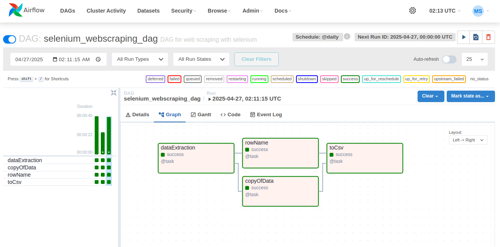

# Airflow_Selenium_Data_Ingestion

# *Overview*
Project repo to demonstrate data extraction from web through web scrapping process using python library Selenium. The exctraction process is automated using Airflow and the final ouput is CSV file.
# *Prerequisites*
To follow along this project need to available on your system below requirements:
- Python3 with Selenium installed
  ```bash
  sudo apt install pyton3

  pip install selenium
  ```
- Apache Airflow running
  ```bash
  airflow webserver port 8080 -d

  airflow scheduler -d
  ```
# *Project Flow*
Airflow Orchestration Data Ingestion with Selenium, create Airflow DAG for data ingestion:
1. import necessary library
   ```python3
   from airflow.decorators import dag, task
   from airflow.operators.python import PythonOperator
   from datetime import datetime, timedelta

   from selenium import webdriver
   from selenium.webdriver.common.by import By
   import time
   import pandas as pd
   ```
2. web connection
   ```python3
   options = webdriver.ChromeOptions()
   options.add_argument("--headless=new")

   driver = webdriver.Chrome(options=options)

   URL = "https://en.wikipedia.org/wiki/List_of_countries_by_carbon_dioxide_emissions"
   ....
   driver.get(URL)
   ....
   ```
3. data fetch from web
   ```python3
   country = driver.find_elements(By.XPATH, '//*[@id="mw-content-text"]/div[1]/table[1]')
   ```
4. data as list
   ```python3
   datas = list()

   for cnt in country:
      rows = cnt.find_elements(By.TAG_NAME, "tr")
      datas = [row.text for row in rows]

   new_data = [item.split() for item in datas]
   ```
5. pandas data frame
   ```python3
   df = pd.DataFrame(countries, columns=description)
   ```
6. save as csv
   ```python3
   df.to_csv("/home/mulyo/airflow_venv/dags/CO2 Emission by countries.csv", index=False)
   ```
   
